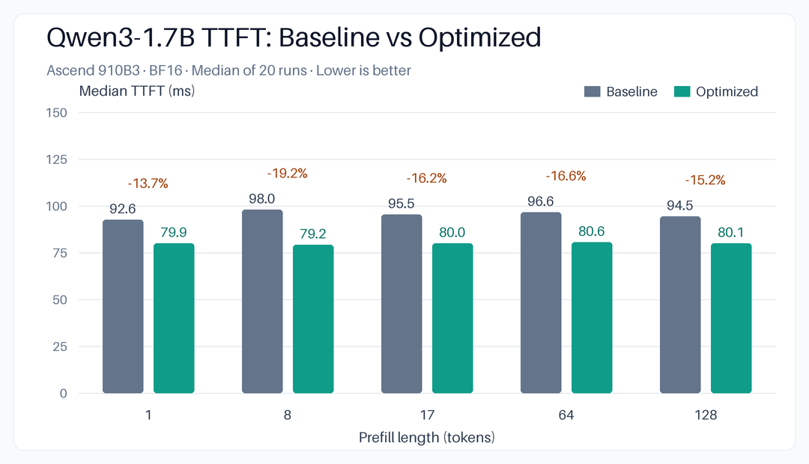
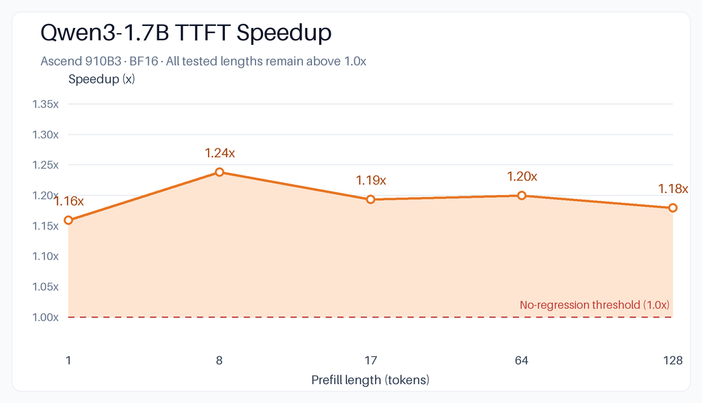
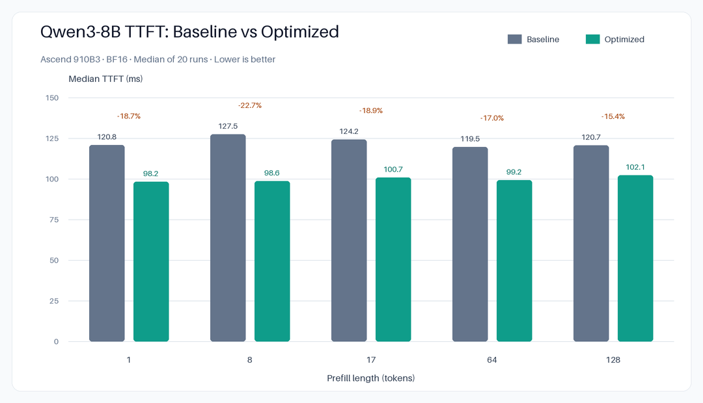
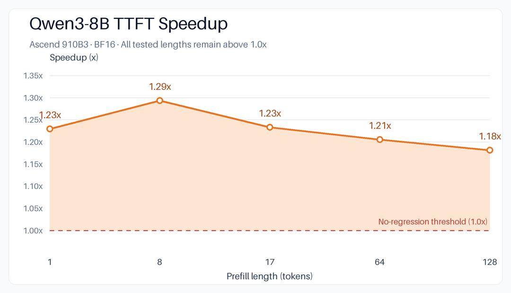

# Qwen3 fused preprocess + official FIA results

## Result

The production optimization fuses Q/K RMSNorm, RoPE, and K/V cache
publication, then calls the existing Ascend fused infer attention (FIA)
operator. It does not replace FIA.

The optimized path is deliberately limited to a case where the cache layout
is guaranteed by the scheduler:

- one request;
- complete `PrefillNoCache` prompt;
- causal BF16 attention with head dimension 128;
- Qwen3 16/32 query heads and 8 KV heads;
- at most 128 tokens, strictly smaller than the scheduler chunk budget;
- a 128-token paged-cache block.

Prefix-cache hits, chunked prompts, mixed batches, decode, MRoPE, unsupported
head layouts, and nonstandard cache blocks use the unchanged production path.

## Accuracy

Baseline and optimized runs used separate fresh vLLM processes. The harness
records every logits call, generated token and logprob, and every written K/V
block in every attention layer.

| Model | Requests | Scenarios | Logits calls | Cache layers | Max logits error | Max cache error | Token mismatches |
|---|---:|---:|---:|---:|---:|---:|---:|
| Qwen3-0.6B | 16 | 6 | 49 | 28 | 0 | 0 | 0 |
| Qwen3-VL-2B-Instruct | 17 | 7 | 57 | 28 | 0 | 0 | 0 |

Both comparisons also report zero mean logits/cache error, zero logprob error,
and no top-logprob-set mismatch. The scenarios cover a 407-token chunked
prompt, a 128-token prefix-cache hit, mixed prompt lengths, eight-request
scheduling, complete prefill, eight generated tokens per request, and a real
Qwen3-VL image request.

## Operator performance

Measured on one Ascend 910B3 with CANN 9.0.1, BF16 Qwen3-0.6B shapes, ten
warmups and 50 timed repetitions. The baseline includes materialized Q/K/V,
the production cache scatter, and FIA. The optimized measurement includes the
fused preprocess, direct contiguous cache publication, and paged FIA.

| Prompt tokens | Baseline (ms) | Optimized (ms) | Speedup |
|---:|---:|---:|---:|
| 1 | 0.589 | 0.445 | 1.323x |
| 8 | 0.589 | 0.444 | 1.326x |
| 17 | 0.613 | 0.461 | 1.329x |
| 64 | 0.607 | 0.459 | 1.322x |
| 128 | 0.601 | 0.454 | 1.324x |

At 128 tokens, fused preprocessing is 0.253 ms. Materializing Q/K/V and then
running the official cache scatter takes 0.360 ms (0.296 + 0.064 ms). Paged
FIA is 0.137 ms and contiguous FIA is 0.139 ms, so attention performance is
preserved; the gain is from removing intermediate K/V materialization and the
separate scatter.

## End-to-end TTFT performance

The complete Qwen3-0.6B engine was measured in eager mode with prefix caching
disabled, one request at a time, one generated token, three warmups per length,
and 20 timed repetitions. Values are medians and include scheduling, all 28
model layers, logits, sampling, and returning the first generated token.

| Prompt tokens | Baseline TTFT (ms) | Optimized TTFT (ms) | Speedup |
|---:|---:|---:|---:|
| 1 | 94.871 | 79.390 | 1.195x |
| 8 | 100.325 | 80.169 | 1.251x |
| 17 | 95.110 | 80.510 | 1.181x |
| 64 | 96.049 | 80.126 | 1.199x |
| 128 | 94.887 | 80.876 | 1.173x |

No tested eligible length regressed. Ineligible production scenarios do not
execute the new kernel and therefore retain the established path.

### Qwen3-1.7B TTFT performance

The same end-to-end methodology was also applied to Qwen3-1.7B on one Ascend
910B3 in BF16 eager mode. Each value is the median of 20 timed runs after three
warmups.

| Prompt tokens | Baseline TTFT (ms) | Optimized TTFT (ms) | Speedup |
|---:|---:|---:|---:|
| 1 | 92.593 | 79.900 | 1.16x |
| 8 | 98.029 | 79.200 | 1.24x |
| 17 | 95.495 | 80.037 | 1.19x |
| 64 | 96.608 | 80.554 | 1.20x |
| 128 | 94.469 | 80.095 | 1.18x |

All five tested prefill lengths improve. The grouped bars show the absolute
median TTFT reduction, and the speedup curve remains above the 1.0x
no-regression threshold at every length.





### Qwen3-8B TTFT performance

The same end-to-end methodology was also applied to Qwen3-8B on one Ascend
910B3 in BF16 eager mode. Each value is the median of 20 timed runs after three
warmups.

| Prompt tokens | Baseline TTFT (ms) | Optimized TTFT (ms) | Speedup |
|---:|---:|---:|---:|
| 1 | 120.775 | 98.242 | 1.23x |
| 8 | 127.481 | 98.557 | 1.29x |
| 17 | 124.206 | 100.709 | 1.23x |
| 64 | 119.528 | 99.160 | 1.21x |
| 128 | 120.664 | 102.138 | 1.18x |

The grouped bars show the absolute median TTFT reduction at every tested
prefill length.



The speedup curve stays above the 1.0x no-regression threshold for all tested
prefill lengths.



## Reproduction

Set `VLLM_ASCEND_ENABLE_QKNORM_PREFILL_ATTENTION=0` and `=1` in separate
processes when running the accuracy and end-to-end benchmarks:

```bash
python benchmarks/scripts/validate_qknorm_prefill_e2e.py \
  --model /tmp/models/Qwen3-0.6B --output-prefix /tmp/qknorm_e2e/run

python benchmarks/scripts/benchmark_qknorm_prefill_e2e.py \
  --model /tmp/models/Qwen3-0.6B --output /tmp/qknorm_e2e/ttft.json

python benchmarks/ops/benchmark_qknorm_rope_prefill_attention.py \
  --seq-len 128 --production-only --repeats 50
```
